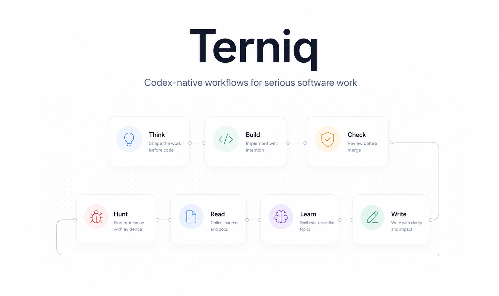

<div align="center">
  
  <h1>Terniq</h1>
  <p><b>Codex-native workflows for serious software work.</b></p>
  <p>Plan clearly. Build deliberately. Review responsibly.</p>
  <a href="https://github.com/Oliver-Silas/terniq/stargazers"></a>
  <a href="https://github.com/Oliver-Silas/terniq/releases"></a>
  <a href="./LICENSE"></a>
  
</div>

<br/>

## Why

Most coding agents are fast, but vague at the exact moments that matter.

They start coding before they pressure-test the problem. They patch bugs before isolating root cause. They "review" code without real verification. They rewrite text by changing the meaning instead of clarifying it.

Terniq exists to package the opposite habits into reusable workflows Codex can actually run.

It is not a random prompt pack. It is a compact operating layer:

- think before implementation
- debug from evidence
- review before merge
- read before synthesizing
- write without AI stiffness
- audit the environment when behavior feels off

## Skills

Each engineering habit maps to a focused skill.

| Skill | When to use it | What it does |
| :--- | :--- | :--- |
| [`terniq-think`](./skills/terniq-think/SKILL.md) | Before building anything new | Shapes the problem, pressure-tests tradeoffs, and gives a cleaner implementation direction before code starts. |
| [`terniq-design`](./skills/terniq-design/SKILL.md) | UI and frontend work | Pushes for intentional interface direction instead of generic AI defaults. |
| [`terniq-check`](./skills/terniq-check/SKILL.md) | After a change, before merge | Reviews the diff, flags risk, asks for verification, and pulls in specialist reviewers when needed. |
| [`terniq-hunt`](./skills/terniq-hunt/SKILL.md) | Any bug or failing behavior | Traces symptoms to root cause before a fix is proposed. |
| [`terniq-read`](./skills/terniq-read/SKILL.md) | URLs, docs, and source material | Pulls content in cleanly so the next step can reason from actual inputs. |
| [`terniq-learn`](./skills/terniq-learn/SKILL.md) | New domains or unfamiliar topics | Synthesizes what matters instead of dumping raw research notes. |
| [`terniq-write`](./skills/terniq-write/SKILL.md) | Editing existing prose | Polishes writing without changing the author's meaning. |
| [`terniq-health`](./skills/terniq-health/SKILL.md) | Codex setup or behavior drift | Audits plugins, routing, environment assumptions, and workflow drift. |

Each skill is backed by the same product shape:

- `skills/` define the main workflow contracts
- `agents/` provide specialist sidecars
- `commands/` expose deterministic entry points

## Commands

If you want stable invocation instead of relying on latent matching:

- `/terniq:plan`
- `/terniq:design`
- `/terniq:review`
- `/terniq:debug`
- `/terniq:read`
- `/terniq:research`
- `/terniq:edit`
- `/terniq:health`

## Chaining Skills

Terniq is designed to chain, but transitions stay explicit.

**Common workflows:**

- **Design a feature**: `terniq-think` -> implement -> `terniq-check`
- **Debug and verify**: `terniq-hunt` -> fix -> `terniq-check`
- **Research and write**: `terniq-read` -> `terniq-learn` -> `terniq-write`
- **Audit the environment**: `terniq-health` -> fix drift -> rerun `terniq-health`

Each arrow is a deliberate user step. Skills do not silently trigger each other.

## Install

Terniq is currently distributed as a local Codex marketplace plugin.

### 1. Clone the repo

```bash
git clone https://github.com/Oliver-Silas/terniq.git
cd terniq
```

### 2. Create the local marketplace wrapper

Codex expects a marketplace root, not just a bare plugin repository.

```bash
TERNIQ_REPO="$(pwd)"
TERNIQ_MARKETPLACE="$HOME/.codex/local-marketplaces/terniq"

mkdir -p "$TERNIQ_MARKETPLACE/.agents/plugins"
mkdir -p "$TERNIQ_MARKETPLACE/plugins"

ln -sfn "$TERNIQ_REPO" "$TERNIQ_MARKETPLACE/plugins/terniq"

cat > "$TERNIQ_MARKETPLACE/.agents/plugins/marketplace.json" <<'JSON'
{
  "name": "terniq",
  "interface": {
    "displayName": "Terniq"
  },
  "plugins": [
    {
      "name": "terniq",
      "source": {
        "source": "local",
        "path": "./plugins/terniq"
      },
      "policy": {
        "installation": "AVAILABLE",
        "authentication": "ON_USE"
      },
      "category": "Productivity"
    }
  ]
}
JSON
```

### 3. Add the marketplace to Codex

```bash
codex plugin marketplace add "$HOME/.codex/local-marketplaces/terniq"
```

### 4. Enable the plugin

Turn on `terniq@terniq` in Codex plugin settings.

If you prefer config directly:

```toml
[plugins."terniq@terniq"]
enabled = true
```

Then restart Codex if the current session does not hot-load the plugin.

## Try It

Start with one of these:

```text
/terniq:plan Help me shape this feature before implementation
/terniq:review Review this diff before I merge it
/terniq:debug Help me isolate why this test is failing
/terniq:research Read these links and turn them into a crisp synthesis
/terniq:health Audit my Codex setup and tell me what is drifting
```

Or use natural prompts:

- "Review this diff before I merge it."
- "Help me debug this failing integration."
- "Plan this feature before we implement it."
- "Read these docs, then summarize the tradeoffs."
- "Check whether my Codex environment is drifting."

## Verification

After changing skill names, command ownership, or README workflow lists, run:

```bash
bash ./scripts/verify-terniq.sh
```

The script checks:

- expected skill directories exist
- expected commands exist
- command ownership points to real skills
- README and resolver still mention all skills and commands

## Repository Layout

```text
terniq/
├── .agents/         # local marketplace metadata
├── .codex-plugin/   # plugin manifest
├── agents/          # specialist sidecars
├── assets/          # README visuals and brand assets
├── commands/        # explicit /terniq:* entry points
├── docs/            # design notes and planning docs
├── scripts/         # lightweight verification helpers
└── skills/          # core workflow definitions
```

## Background

Terniq is built around a simple belief:

AI should speed up good engineering habits, not replace them with vague confidence.

That is why the project stays narrow:

- one workflow per skill
- small number of commands
- clear boundaries between thinking, debugging, review, research, and writing
- enough structure to be reusable, not so much structure that it becomes ceremony

## Contributing

Ideas, fixes, and workflow improvements are welcome.

Start here:

- [Contributing guide](./CONTRIBUTING.md)
- [Design spec](./docs/2026-04-25-v1-design.md)
- [Skills map](./skills/AGENTS.md)
- [Routing map](./skills/RESOLVER.md)

## License

[MIT](./LICENSE)
