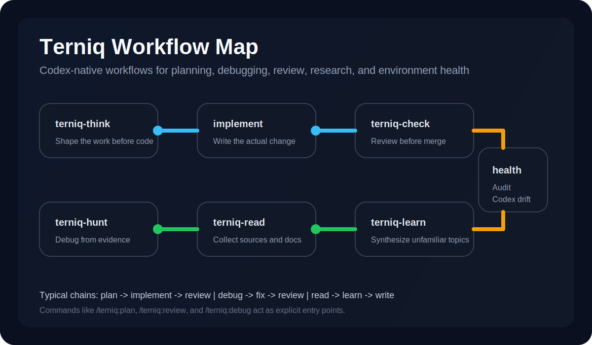

# Terniq

Terniq is a Codex-native workflow plugin for serious software work.

It adds a practical layer on top of coding agents:

- plan before implementation
- debug from evidence
- review before merge
- design with intent
- read and research without bluffing
- edit writing without AI stiffness
- audit the Codex environment itself

Terniq is not trying to be another bag of prompts. It is a workflow pack:

- `skills/` are the main workflows
- `agents/` are specialist sidecars
- `commands/` are explicit user entry points



## Why Terniq

Most agent workflows fail in predictable ways:

- they code before they think
- they patch before they isolate root cause
- they "review" without real verification
- they rewrite text by changing the meaning

Terniq exists to push the opposite habits into the default loop.

## What You Get

### 8 core skills

| Skill | What it does |
| --- | --- |
| `terniq-think` | plan, evaluate tradeoffs, and shape implementation before coding |
| `terniq-design` | guide UI direction and frontend iteration with browser-aware discipline |
| `terniq-check` | review diffs, triage changes, and enforce verification |
| `terniq-hunt` | debug from symptoms to root cause before fixing |
| `terniq-read` | ingest external links, pages, and documents cleanly |
| `terniq-learn` | research unfamiliar topics and synthesize findings |
| `terniq-write` | polish existing prose without changing meaning |
| `terniq-health` | audit Codex environment drift, plugins, and workflow setup |

### 8 explicit commands

- `/terniq:plan`
- `/terniq:design`
- `/terniq:review`
- `/terniq:debug`
- `/terniq:read`
- `/terniq:research`
- `/terniq:edit`
- `/terniq:health`

### 5 specialist agents

- `reviewer-security`
- `reviewer-architecture`
- `reviewer-frontend`
- `researcher`
- `environment-auditor`

## Quick Start

### 1. Clone the repo

```bash
git clone https://github.com/Oliver-Silas/terniq.git
cd terniq
```

### 2. Create a local Codex marketplace wrapper

Codex currently expects a marketplace root, not just a bare plugin repo.

Use this once:

```bash
TERNIQ_REPO="$(pwd)"
TERNIQ_MARKETPLACE="$HOME/.codex/local-marketplaces/terniq"

mkdir -p "$TERNIQ_MARKETPLACE/.agents/plugins"
mkdir -p "$TERNIQ_MARKETPLACE/plugins"

ln -sfn "$TERNIQ_REPO" "$TERNIQ_MARKETPLACE/plugins/terniq"

cat > "$TERNIQ_MARKETPLACE/.agents/plugins/marketplace.json" <<'JSON'
{
  "name": "terniq",
  "interface": {
    "displayName": "Terniq"
  },
  "plugins": [
    {
      "name": "terniq",
      "source": {
        "source": "local",
        "path": "./plugins/terniq"
      },
      "policy": {
        "installation": "AVAILABLE",
        "authentication": "ON_USE"
      },
      "category": "Productivity"
    }
  ]
}
JSON
```

### 3. Add the marketplace to Codex

```bash
codex plugin marketplace add "$HOME/.codex/local-marketplaces/terniq"
```

### 4. Enable the plugin

Enable `terniq@terniq` in Codex plugin settings.

If you manage it through config directly, add:

```toml
[plugins."terniq@terniq"]
enabled = true
```

Then restart Codex if the current session does not hot-load the new plugin.

## Try It In 2 Minutes

After installation, start with any of these:

```text
/terniq:plan Help me shape this feature before implementation
/terniq:review Review this diff before I merge it
/terniq:debug Help me isolate why this test is failing
/terniq:research Read these links and turn them into a crisp synthesis
/terniq:health Audit my Codex setup and tell me what is drifting
```

Or use natural prompts:

- "Review this diff before I merge it."
- "Help me debug this failing integration."
- "Plan this feature before we implement it."
- "Read these docs, then summarize the tradeoffs."
- "Check whether my Codex environment is drifting."

## Typical Workflows

Terniq is designed to chain cleanly:

- `terniq-think` -> implement -> `terniq-check`
- `terniq-hunt` -> fix -> `terniq-check`
- `terniq-read` -> `terniq-learn` -> `terniq-write`
- `terniq-design` -> browser verification -> `terniq-check`
- `terniq-health` -> fix drift -> rerun `terniq-health`

## How Terniq Is Organized

### `skills/`

This is the product surface. Each skill defines one durable workflow contract.

### `agents/`

These are specialist helpers used by the main workflows when the job gets broader or needs parallel scrutiny.

### `commands/`

These are deterministic entry points for users who want stable invocation instead of relying on latent matching.

## Repository Layout

```text
terniq/
├── .agents/         # local marketplace metadata kept in the repo
├── .codex-plugin/   # plugin manifest
├── agents/          # specialist sidecars
├── commands/        # explicit /terniq:* commands
├── docs/            # design notes and planning docs
├── scripts/         # lightweight verification helpers
└── skills/          # core workflow definitions
```

## Verification

After changing skill names, command ownership, or README workflow lists, run:

```bash
bash ./scripts/verify-terniq.sh
```

The script checks:

- expected skill directories exist
- expected commands exist
- command ownership points to real skills
- README and resolver still mention all skills and commands

## Current Status

Terniq is usable today, but still early.

Current state:

- full first-pass workflow suite is implemented
- local Codex installation path is verified
- commands, agents, and routing are in place
- repo structure is stable enough for iteration

Still improving:

- richer discovery metadata
- smoother installation flow
- better marketplace-ready assets
- more real-world trigger testing

## Open Source Notes

Terniq is published as an open repository so others can:

- install it locally
- inspect how the workflows are structured
- adapt the patterns into their own Codex setup
- contribute improvements back upstream

If you want to contribute, start with [CONTRIBUTING.md](./CONTRIBUTING.md).

## Who This Is For

Terniq is a good fit if you:

- use Codex heavily and want more disciplined workflows
- review code often and care about verification, not just vibes
- debug real systems and hate guess-first patching
- want reusable workflows instead of one-off prompt snippets

It is probably not for you if you only want generic "make this better" prompts with no structure.

## Docs

- [Design spec](./docs/2026-04-25-v1-design.md)
- [Plugin manifest](./.codex-plugin/plugin.json)
- [Skills map](./skills/AGENTS.md)
- [Routing map](./skills/RESOLVER.md)
- [Verification script](./scripts/verify-terniq.sh)

## License

[MIT](./LICENSE)
